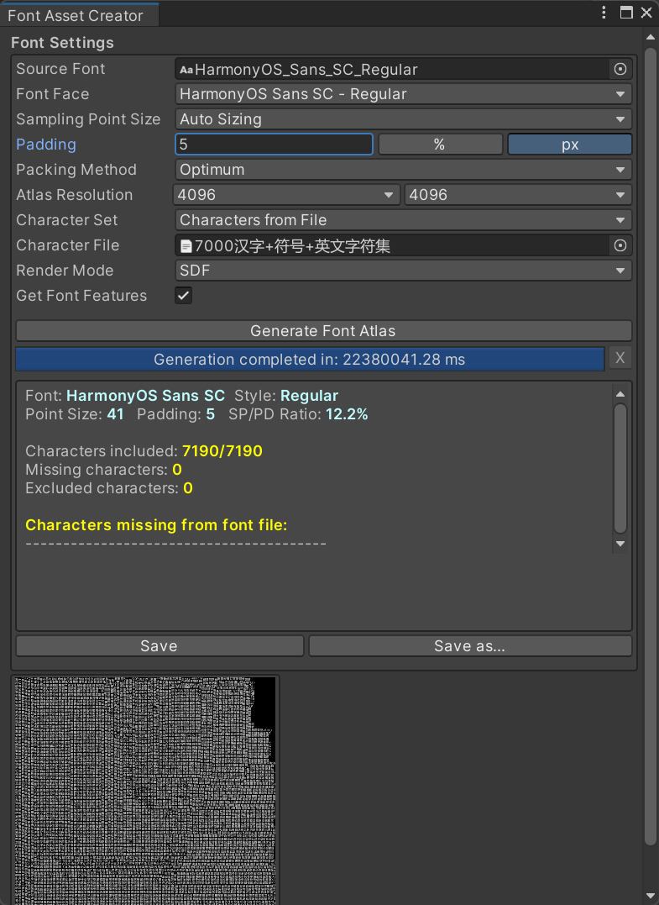
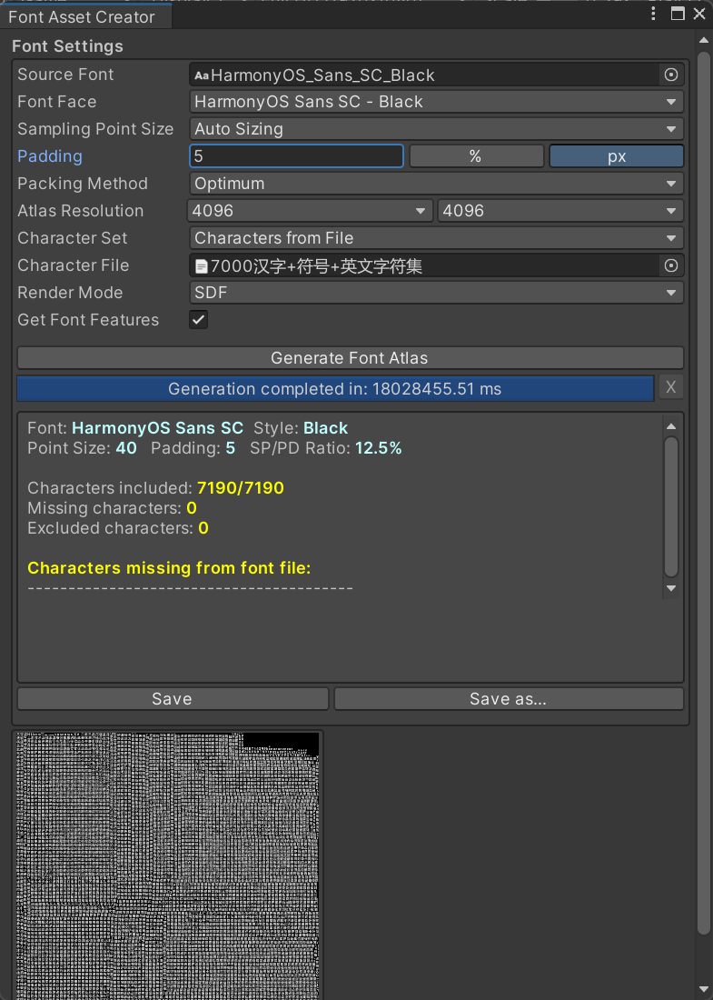

## Unity-TextMeshPro-Chinese-HarmonyOS_Sans_SC

中文字符集，可以用来创建 Unity TextMeshPro 中文字体。

包含: 常用汉字、数字、英文字母大小写(a,b...,A,B...)、常用特殊符号(@#...)、常用中文符号(，。！...)、常用英文符号(,.!...)。

文本来自 [Unity-TextMeshPro-Chinese-Characters-Set](https://github.com/wy-luke/Unity-TextMeshPro-Chinese-Characters-Set.git)

